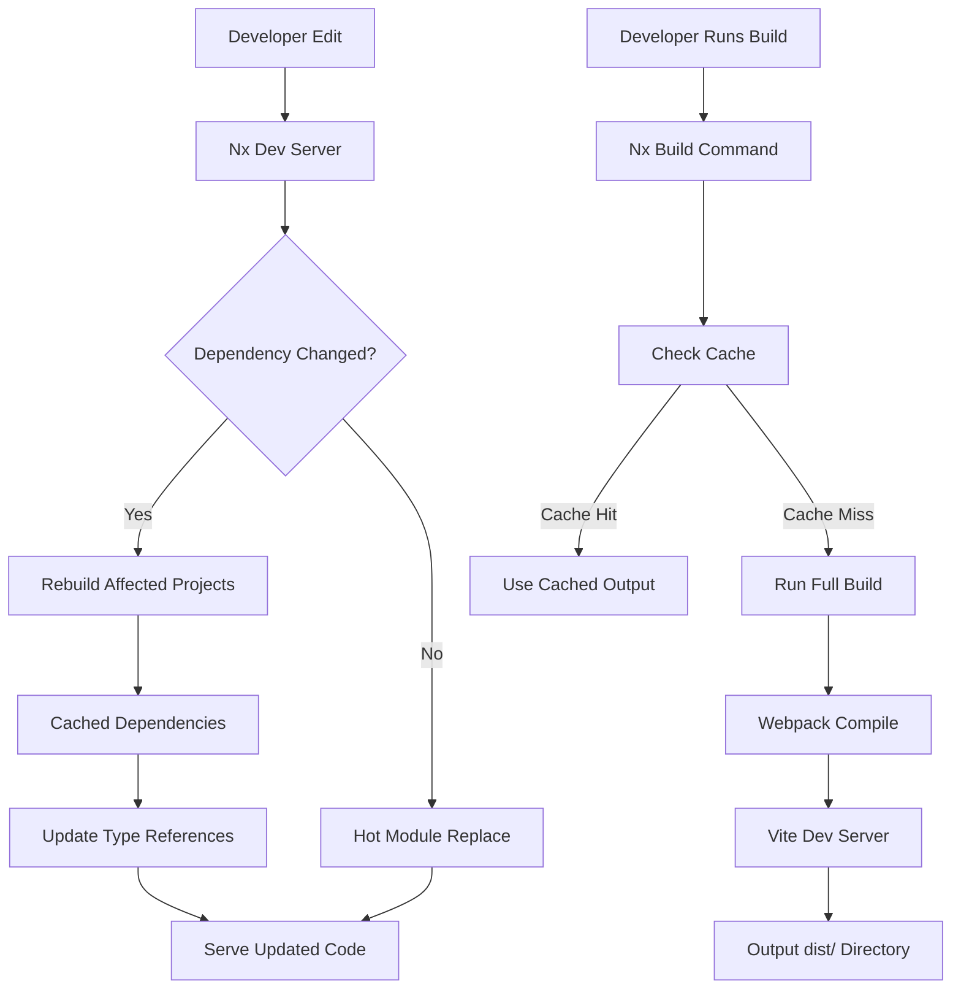

# Build System Documentation

## Overview

This document provides comprehensive details about how the **Nx build system** manages the compilation, bundling, and serving of this monorepo. Understanding the build process is crucial for developers to optimize development workflows, manage production builds, and troubleshoot build issues.

---

## Table of Contents

1. [Build Architecture](#build-architecture)
2. [Nx Configuration](#nx-configuration)
3. [Development Builds](#development-builds)
4. [Production Builds](#production-builds)
5. [Webpack Build System](#webpack-build-system)
6. [Vite Development Server](#vite-development-server)
7. [Build Artifacts](#build-artifacts)
8. [Testing the Builds](#testing-the-builds)
9. [Optimizing Build Performance](#optimizing-build-performance)
10. [Troubleshooting Common Issues](#troubleshooting-common-issues)

---

## Build Architecture

### Monorepo Build Strategy

This Nx workspace uses a **monorepo build strategy** where:

- **Shared dependencies** are hoisted to the root node_modules
- **TypeScript project references** ensure type safety across project boundaries
- **Intelligent caching** speeds up incremental builds
- **Selective recompilation** only rebuilds affected projects when dependencies change

### Build Flow Diagram



### Build System Components

The build system consists of several interconnected tools:

| Component | Purpose | Configuration File |
|-----------|---------|-------------------|
| Nx CLI | Task orchestration and caching | `nx.json` |
| Webpack | Production bundle compilation | `webpack.config.js` |
| Vite | Fast development server and build | `vite.config.mts` |
| TypeScript Compiler | Type checking and transpilation | `tsconfig*.json` files |
| SWC | Optimized compilation for dev builds | - |

---

## Nx Configuration

### nx.json Overview

The **nx.json** file is the heart of the build configuration:

```json
{
  "$schema": "./node_modules/nx/schemas/nx-schema.json",
  "plugins": [
    {
      "plugin": "@nx/js/typescript",
      "options": {
        "typecheck": { "targetName": "typecheck" },
        "build": { "targetName": "build", "configName": "tsconfig.lib.json" }
      }
    },
    {
      "plugin": "@nx/webpack/plugin",
      "options": {
        "buildTargetName": "build",
        "serveTargetName": "serve",
        "previewTargetName": "preview",
        "buildDepsTargetName": "build-deps",
        "watchDepsTargetName": "watch-deps"
      }
    },
    {
      "plugin": "@nx/vite/plugin",
      "options": {
        "buildTargetName": "build",
        "testTargetName": "test",
        "serveTargetName": "serve",
        "devTargetName": "dev",
        "previewTargetName": "preview",
        "serveStaticTargetName": "serve-static"
      }
    },
    {
      "plugin": "@nx/jest/plugin",
      "options": {
        "targetName": "test"
      }
    }
  ],
  "targetDefaults": {
    "@nx/js:tsc": {
      "cache": true,
      "dependsOn": ["^build"],
      "inputs": ["production", "^production"]
    }
  }
}
```

### Available Targets

Nx defines these targets per-project based on the plugins:

| Target | Description | Command Example |
|--------|-------------|-----------------|
| `build` | Compile for production | `nx build api` |
| `serve` | Run in development mode | `nx serve api` |
| `test` | Run unit tests | `nx test api` |
| `lint` | Run ESLint | `nx lint api` |
| `e2e` | Run end-to-end tests | `nx e2e client-e2e` |
| `typecheck` | TypeScript type checking | `nx typecheck api` |

### Project Dependencies and Build Order

Nx automatically tracks dependencies between projects:

```bash
# Visualize the build graph
npx nx graph --files

# See what will be rebuilt
npx nx show project client

# Check task dependencies
npx nx show target build api
```

---

## Development Builds

### Starting Development Servers

The development workflow is optimized for rapid iteration:

#### Backend API (NestJS)

**Command:** `pnpm dev:api` or `nx serve api`

**Process:**
1. Nx checks if dependencies are up to date
2. Uses SWC for fast TypeScript compilation
3. Starts NestJS with hot module replacement
4. Listens on configured port (default: 3000)

**Configuration in project.json:**
```json
{
  "serve": {
    "continuous": true,
    "executor": "@nx/js/node",
    "defaultConfiguration": "development",
    "dependsOn": ["build"],
    "options": {
      "buildTarget": "api:build",
      "runBuildTargetDependencies": false
    },
    "configurations": {
      "development": {
        "buildTarget": "api:build:development"
      }
    }
  }
}
```

#### Frontend Client (React + Vite)

**Command:** `pnpm dev:client` or `nx serve client`

**Process:**
1. Vite serves static files and React app
2. Hot module replacement for instant updates
3. TypeScript errors displayed in editor/terminal
4. Port 4200 by default (as per vite.config.mts)

**Vite Configuration Highlights:**
```typescript
export default defineConfig(() => ({
  server: {
    port: 4200,
    host: 'localhost',
  },
  plugins: [react(), nxViteTsPaths()],
  build: {
    outDir: '../dist/client',
    emptyOutDir: true,
  },
}));
```

### Development Environment Features

#### Hot Module Replacement (HMR)

Both development servers support HMR:

- **Backend API**: NestJS updates code without full restart
- **Frontend Client**: React components reload instantly
- **No Page Refresh Required**: Changes apply automatically

#### TypeScript Watch Mode

TypeScript compiler runs in watch mode during development:

```bash
# Background compilation for faster subsequent changes
npx tsc --watch

# Nx handles this automatically with --watch flag
nx serve api --watch
```

---

## Production Builds

### Building for Production

Production builds create optimized bundles ready for deployment:

#### Build API (NestJS)

**Command:** `pnpm build:api` or `nx build api`

**Webpack Configuration:**
- Mode: `production`
- Output to: `dist/apps/api/`
- Minification enabled
- Bundle optimization applied
- Tree shaking removes unused code

**Configuration:**
```json
{
  "build": {
    "executor": "nx:run-commands",
    "dependsOn": ["^build"],
    "options": {
      "command": "webpack --mode production",
      "cwd": "apps/api"
    },
    "configurations": {
      "development": {
        "command": "webpack --mode development",
        "cwd": "apps/api"
      }
    }
  }
}
```

#### Build Client (React)

**Command:** `pnpm build:client` or `nx build client`

**Vite Configuration:**
- Output directory: `dist/client/`
- Empty out directory before building
- Size reports generated during build
- Asset copying configured in vite.config.mts

**Build Output Structure:**
```
dist/client/
├── assets/
│   ├── [hash].js
│   ├── [hash].css
│   └── index.html
├── favicon.ico
└── ...other static files
```

### Build Scripts in package.json

The root `package.json` defines these convenient scripts:

```json
{
  "scripts": {
    "dev:api": "nx serve api",
    "build:api": "nx build api",
    "dev:client": "nx serve client",
    "build:client": "nx build client",
    "test": "nx run-many -t test"
  }
}
```

### Production Build Checklist

Before deploying, ensure:

- ✅ `pnpm build:api` completes successfully
- ✅ `pnpm build:client` generates output in `dist/`
- ✅ No TypeScript errors in compilation
- ✅ Bundle sizes within acceptable limits
- ✅ Environment variables set appropriately
- ✅ Database migrations applied (`npx prisma migrate`)

---

## Webpack Build System

### Webpack Role

Webpack handles **production builds** for the NestJS API:

- Bundles Node.js modules together
- Applies optimizations (compression, minification)
- Handles multiple entry/exit points if needed
- Supports code splitting for larger applications

### Webpack Configuration Details

Located in `apps/api/webpack.config.js`:

```javascript
module.exports = {
  mode: 'production',
  target: 'node',
  entry: './src/main.ts',
  output: {
    path: __dirname + '/../dist/apps/api',
    filename: 'main.js',
  },
  resolve: {
    extensions: ['.ts', '.js'],
  },
}
```

### Build Process Steps

1. **Read tsconfig**: TypeScript compiler options extracted
2. **Babel Transpilation** (if needed): Legacy JavaScript support
3. **TypeScript Compilation**: TS → JS transformation
4. **Module Resolution**: Node modules + local imports resolved
5. **Code Splitting**: Separate bundles for lazy-loaded features
6. **Optimization**: Minification, compression enabled
7. **Output Generation**: Bundled file to dist directory

---

## Vite Development Server

### Vite Advantages

Vite provides a blazing-fast development experience:

- **Instant Server Start**: Based on native ES modules
- **Lightning-fast HMR**: Updates in milliseconds
- **TypeScript Support**: Built-in with zero configuration
- **Plugin Ecosystem**: React, Vue, Svelte plugins available

### Vite Configuration Overview

**File:** `apps/client/vite.config.mts`

```typescript
import { defineConfig } from 'vite';
import react from '@vitejs/plugin-react';
import { nxViteTsPaths } from '@nx/vite/plugins/nx-tsconfig-paths.plugin';
import { nxCopyAssetsPlugin } from '@nx/vite/plugins/nx-copy-assets.plugin';

export default defineConfig(() => ({
  root: import.meta.dirname,
  cacheDir: '../node_modules/.vite/client',
  server: {
    port: 4200,
    host: 'localhost',
  },
  preview: {
    port: 4200,
    host: 'localhost',
  },
  plugins: [react(), nxViteTsPaths(), nxCopyAssetsPlugin(['*.md'])],
  build: {
    outDir: '../dist/client',
    emptyOutDir: true,
    reportCompressedSize: true,
  },
}));
```

### Vite Plugins Used

| Plugin | Purpose |
|--------|---------|
| `react()` | React JSX transformation and HMR |
| `nxViteTsPaths()` | TypeScript path aliases synchronization |
| `nxCopyAssetsPlugin()` | Copy static assets during build |

---

## Build Artifacts

### Dist Directory Structure

After production builds, the `dist/` directory contains:

```
dist/
├── api/                    # API production build
│   ├── main.js            # Bundled NestJS application
│   ├── package.json       # Standalone package.json
│   └── ...                # Additional bundled modules
│
└── client/                 # Client production build
    ├── assets/            # Minified JS/CSS bundles
    │   ├── index-[hash].js
    │   └── main-[hash].css
    ├── favicon.ico        # Web app icons
    └── index.html         # Entry HTML with asset links
```

### Deployment Considerations

When deploying to production:

1. **Copy dist directory** to deployment server
2. **Set NODE_ENV=production** environment variable
3. **Enable HTTPS** for sensitive data protection
4. **Configure CDN** if serving static files remotely
5. **Update API URL** in React frontend if deployed separately

---

## Testing the Builds

### Local Build Verification

Test your builds locally before deployment:

```bash
# Clean previous builds
npx nx reset

# Test full production build
pnpm build:api && pnpm build:client

# Verify artifacts exist
ls -la dist/

# Check bundle sizes
du -sh dist/**/*

# Review build logs for warnings/errors
pnpm build:api --verbose
```

### CI Build Pipeline

In CI/CD environments, runs these builds:

```yaml
# Example GitHub Actions step
- name: Build API
  run: pnpm build:api
  
- name: Build Client
  run: pnpm build:client

- name: Upload Artifacts
  uses: actions/upload-artifact@v3
  with:
    name: nx-builds
    path: dist/
```

---

## Optimizing Build Performance

### Caching Strategies

Nx caching dramatically improves build times:

```bash
# Check cache status
npx nx show projects --web

# Clear specific project cache
npx nx reset api

# Reset all caches
npx nx reset --all

# View cached tasks
npx nx cache-check --target=test --project=api
```

### Watch Dependencies

During development, Nx watches dependencies and rebuilds only when needed:

```bash
# Start with watching dependencies
npx nx watch-deps api --until-built=true

# Or the shorthand
npx nx build-deps api
```

### Bundle Size Optimization

Tips for reducing bundle size:

1. **Use lazy loading** for routes and large components
2. **Tree shaking** automatically removes unused imports
3. **Split chunks** for code splitting
4. **Configure Vite compression** with gzip/brotli
5. **Minimize vendor bloat** by using scoped packages

```typescript
// Example lazy route import
import { lazy } from 'react';
const Dashboard = lazy(() => import('./features/dashboard'));
```

### SWC Optimization

The project uses SWC for faster TypeScript compilation:

- **Development**: Sub-second transpilation
- **Production**: Optimized bundle generation

Ensure SWC is installed (`pnpm add @swc/core`), though Nx handles this automatically.

---

## Troubleshooting Common Issues

### Build Caches Not Updating

If changes aren't reflected:

```bash
# Clear all caches
npx nx reset --all

# Force rebuild specific project
npx nx build api --skip-cache
```

### TypeScript Errors After Changes

When editing shared code in libs/:

```bash
# Sync project references
npx nx sync

# Check if types are up to date
npx nx typecheck api
```

### Vite HMR Not Working

Common fix for hot reload issues:

```bash
# Delete Vite cache and restart
rm -rf node_modules/.vite/client
pnpm dev:client
```

### Webpack Build Fails

Check these if webpack compilation errors occur:

1. **Update Node.js** to LTS version
2. **Clear pnpm cache**: `pnpm store prune`
3. **Reinstall dependencies**: `pnpm install`
4. **Check TypeScript compatibility**: Ensure no incompatible packages

### Port Already in Use

When ports 3000 or 4200 are occupied:

```bash
# Backend API (change port in nest-cli.json or environment)
API_PORT=3001 npx nx serve api

# Frontend Client (Vite config modification)
# Update apps/client/vite.config.mts server.port setting
```

---

## Nx Commands Reference

### Common Build Commands

| Command | Description |
|---------|-------------|
| `npx nx build api` | Production build API |
| `npx nx serve api` | Development server API |
| `npx nx build client` | Production build client |
| `npx nx serve client` | Development server client |
| `npx nx run-many -t build` | Build all projects |
| `npx nx reset` | Clear all caches |

### Nx Graph Visualizer

```bash
# View dependency graph visually
npx nx graph --files

# Show project dependencies
npx nx show projects api

# Check target configuration
npx nx show target build api
```

---

## Conclusion

This Nx workspace provides a robust, scalable build system that balances development speed with production quality. The combination of Nx task orchestration, Webpack optimization, Vite development server, and intelligent caching ensures efficient builds across the monorepo.

### Key Takeaways

1. **Nx handles orchestration**: Let Nx manage dependencies and caching
2. **TypeScript project references**: Ensure type safety across boundaries
3. **Vite for frontend**: Fast dev experience with React
4. **Webpack for backend**: Production-optimized bundles for NestJS
5. **Caching is your friend**: Use `nx reset` strategically, not routinely

### Next Steps

For production deployment:

1. Run `pnpm build:api` and `pnpm build:client`
2. Copy artifacts from `dist/` to deployment server
3. Configure environment variables appropriately
4. Set up automated CI/CD pipeline with these build commands

---

*Document Version: 1.0.0*  
*Last Updated: 2024*