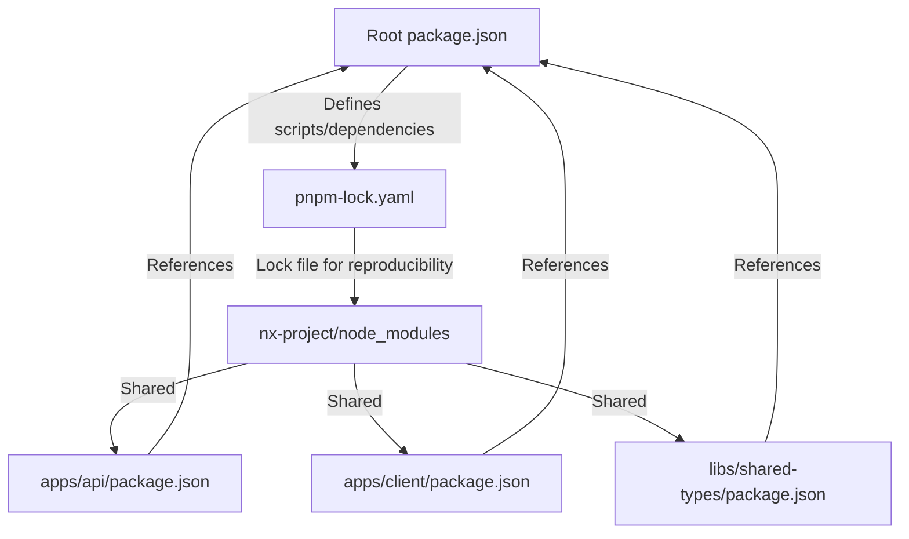

# Dependencies Management Documentation

## Overview

This document provides comprehensive details about how dependencies are managed in this Nx monorepo project using **pnpm** as the package manager. Understanding the dependency structure is crucial for adding new packages, troubleshooting issues, and maintaining a healthy dependency tree.

---

## Table of Contents

1. [Root Package.json](#root-packagejson)
2. [PNPM Workspace Configuration](#pnpm-workspace-configuration)
3. [Dependency Tree Structure](#dependency-tree-structure)
4. [Development vs Production Dependencies](#development-vs-production-dependencies)
5. [Managing Dependencies](#managing-dependencies)
6. [Lock Files Explained](#lock-files-explained)
7. [Best Practices](#best-practices)

---

## Root Package.json

### Location and Purpose

Located at `package.json` in the project root, this file defines:

- **Scripts**: Build, dev, test commands available across the workspace
- **Dev Dependencies**: Development-only packages (test tools, bundlers, linters)
- **Dependencies**: Runtime dependencies used by all applications
- **Private Flag**: Prevents accidental publishing to npm registry

### Content Overview

```json
{
  "name": "@org/source",
  "version": "0.0.0",
  "license": "MIT",
  "private": true,
  "scripts": {
    "dev:api": "nx serve api",
    "build:api": "nx build api",
    "dev:client": "nx serve client",
    "build:client": "nx build client",
    "test": "nx run-many -t test"
  },
  "workspaces": ["packages/*"],
  "dependencies": {
    "@nestjs/common": "11.0.0",
    "@nestjs/core": "11.0.0",
    "react": "19.0.0",
    "pg": "8.19.0",
    "zod": "4.3.6",
    // ... more runtime dependencies
  },
  "devDependencies": {
    "@nx/react": "22.5.3",
    "@playwright/test": "1.36.0",
    // ... more dev dependencies
  }
}
```

### Dependency Groups Explained

#### Runtime Dependencies (`dependencies`)

These packages are required when the application runs:

| Package | Purpose | Version Strategy |
|---------|---------|------------------|
| `@nestjs/*` | Backend framework | Pin major versions, allow minors |
| `react`, `react-dom` | Frontend UI | Latest LTS version |
| `mongoose` | MongoDB ODM | Same as NestJS version |
| `pg`, `prisma` | PostgreSQL ORM | Compatible with current NestJS |
| `zod` | Validation schemas | Latest stable release |

#### Development Dependencies (`devDependencies`)

These packages are only needed during development and testing:

| Package | Purpose | Version Strategy |
|---------|---------|------------------|
| `@nx/*` | Nx plugins and tools | Strict versions |
| `jest`, `vitest` | Test runners | Latest with TypeScript support |
| `eslint`, `prettier` | Code quality | Consistent updates |
| `vite`, `@vitejs/plugin-react` | Frontend build tools | Compatible versions |

### Version Strategies

The project uses **consistent version strategies** across all dependencies:

1. **Exact Versions**: Used for critical packages like TypeScript, Node.js tooling
2. **Semver Ranges**: Major versions pinned, minor/patch allowed (e.g., `11.0.0`)
3. **Latest LTS**: Frameworks and UI libraries get latest stable releases

---

## PNPM Workspace Configuration

### Location and Purpose

Located at `pnpm-workspace.yaml`, this file configures pnpm to recognize the monorepo structure:

```yaml
packages:
  - 'packages/*'
```

This configuration tells pnpm to:
- Link all packages in the `packages/` directory
- Share a single root `node_modules`
- Deduplicate dependencies across workspaces

### Root Configuration Files

| File | Purpose | Git Status |
|------|---------|------------|
| `package.json` | Root package definition | ✅ Tracked |
| `pnpm-lock.yaml` | Deterministic lock file | ✅ Tracked |
| `pnpm-workspace.yaml` | Workspace configuration | ✅ Tracked |
| `.npmrc` | pnpm options | ✅ Tracked (if exists) |

### Why Not Use Just package.json scripts?

The workspace structure uses both:
- **Scripts** in root `package.json` for convenience
- **pnpm workspaces** for dependency management across projects
- **Lock file** (`pnpm-lock.yaml`) for reproducible installs

---

## Dependency Tree Structure

### Hoisted Dependencies

PNPM hoists all dependencies to the root `node_modules/` folder. This means:

```bash
# All apps and libs share this single node_modules
nx-project/node_modules/
├── @nestjs/          # Backend framework packages
├── react             # Frontend UI library
├── jest              # Test runner
└── ...
```

### Workspace Linking

Each project (apps/api, apps/client, libs/*) has its own `package.json` that **references** dependencies via the pnpm workspace protocol:

```json
{
  "name": "api",
  "dependencies": {
    "@shared-types": "workspace:*"
  }
}
```

The `workspace:*` specifier tells pnpm to link from the local workspace instead of downloading from npm.

### Dependency Flow Diagram



### Library Package Structure

Each library in `libs/` can be:
- **Private**: No `package.json`, only used internally
- **Publishable**: Full npm package with version, import paths

---

## Development vs Production Dependencies

### Identifying Dependency Purpose

| Category | Location | Used In | Examples |
|---------|----------|---------|----------|
| Runtime | `dependencies` | Build/Prod runs | NestJS, React, Prisma |
| Dev Only | `devDependencies` | Dev/Test only | Jest, ESLint, Prettier |
| Workspaces | `pnpm-workspace.yaml` | Monorepo linking | libs/* packages |

### Adding New Dependencies

#### Add to Production (Runtime)

```bash
# Add runtime dependency
pnpm add new-runtime-package

# Update your app's package.json in apps/api or libs/
# Then install to sync with lock file
pnpm install
```

#### Add to Development Only

```bash
# Add dev dependency
pnpm add -D new-dev-package

# This will only be installed during development
```

### Dependency Bloat Prevention

To avoid bloating your production bundles:

1. **Use `devDependencies`** for testing/linting tools
2. **Audit dependencies** before committing:
   ```bash
   pnpm audit --prod
   pnpm audit --dev
   ```
3. **Remove unused packages**:
   ```bash
   pnpm prune
   ```

---

## Managing Dependencies

### Installing Dependencies

```bash
# Install all from root
pnpm install

# Skip lock file generation (CI environments)
pnpm install --no-frozen-lockfile

# Install specific workspace packages
pnpm add @org/shared-types

# Add to dev dependencies
pnpm add -D @types/node
```

### Updating Dependencies

#### Safe Updates (No Breaking Changes)

```bash
# Update minor and patch versions only
pnpm update

# Force update all, including breaking changes
pnpm update --latest

# Update specific package
pnpm update react@^19
```

#### Handling Breaking Changes

1. Check the package changelog first
2. Test in a development environment
3. Run full test suite after updates
4. Revert if necessary and document why

### Resolving Dependency Conflicts

If you encounter conflicts:

```bash
# View dependency tree
pnpm ls <package-name>

# Check for multiple versions
pnpm list --recursive

# Force install specific version
pnpm add package@1.2.3 --legacy-peer-deps
```

### Pruning Dependencies

Remove unused packages to save space:

```bash
# Remove all unused dependencies
pnpm prune

# Prune dev dependencies only
pnpm prune --production

# Check what was pruned
pnpm outdated
```

---

## Lock Files Explained

### PNPM Lock File (`pnpm-lock.yaml`)

Located at the root, this file contains:
- **Exact versions** of all installed packages
- **Resolved dependencies** from npm registry
- **Workspace linking** information for monorepo

#### Why Track This?

1. **Reproducibility**: Same install on any machine
2. **Audit Ready**: Security vulnerabilities easily spotted
3. **CI/CD Compatible**: No version mismatches in pipelines

#### Never Edit Manually

The lock file is automatically generated when you run `pnpm install`. Editing it manually will cause inconsistencies.

### Package.json Structure Details

```json
{
  "name": "@org/source",
  "version": "0.0.0",
  "private": true,
  
  // Scripts define npm shortcuts
  "scripts": {
    "dev:api": "nx serve api"
  },
  
  // Production dependencies
  "dependencies": {
    "@nestjs/common": "11.0.0"
  },
  
  // Development-only dependencies
  "devDependencies": {
    "jest": "30.0.2"
  }
}
```

---

## Best Practices

### Dependency Management Checklist

- [ ] Pin major versions for critical packages
- [ ] Use semver ranges for minor/patch updates (`^` or `~`)
- [ ] Run `pnpm audit` before releasing changes
- [ ] Test after updating dependencies
- [ ] Document breaking changes in PR descriptions
- [ ] Keep lock file committed to version control

### Regular Maintenance Tasks

```bash
# Weekly: Check for security updates
pnpm audit

# Monthly: Review and remove unused dependencies  
pnpm outdated --recursive
pnpm prune

# Quarterly: Update major versions
pnpm update @types/* react nestjs
```

### CI/CD Dependencies

In CI environments, always include lock file regeneration:

```yaml
# Example GitHub Actions step
- uses: pnpm/action-setup@v2
  with:
    run_install: true
    
- run: pnpm run lint
- run: pnpm run test
```

### Workspace Best Practices

1. **Avoid Cross-Workspace Cyclic Dependencies**
   - Library A shouldn't import from Library B and vice versa
   - Use shared-types library for common interfaces
   
2. **Keep Package Names Consistent**
   - Use `@org/` scope for all workspace packages
   - Example: `@org/shared-types`, `@org/ui`
   
3. **Document Import Paths**
   - Add comments explaining why certain packages are used
   - Link to original package documentation
   
4. **Pin Workspace Dependencies**
   - Use `workspace:*` for local monorepo dependencies
   - Avoid version ranges that cause ambiguity

---

## Quick Reference Commands

| Command | Description |
|---------|-------------|
| `pnpm install` | Install all dependencies |
| `pnpm add <pkg>` | Add production dependency |
| `pnpm add -D <pkg>` | Add dev dependency |
| `pnpm remove <pkg>` | Remove package |
| `pnpm update` | Update all to latest versions |
| `pnpm outdated` | Show packages needing updates |
| `pnpm prune` | Remove unused dependencies |
| `pnpm audit` | Check for vulnerabilities |

---

## Related Documentation

- [PNPM Documentation](https://pnpm.io/) - Official pnpm docs
- [Nx Workspaces](https://nx.dev/features/workspace-overview) - Monorepo best practices
- [Package Manager Guides](https://nodejs.org/api/packages.html) - npm/pnpm/yarn guide

---

*Document Version: 1.0.0*  
*Last Updated: 2024*